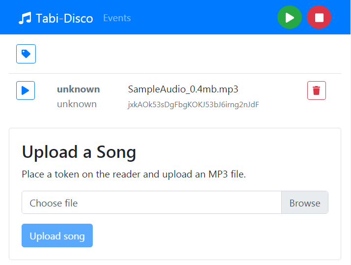

# Tabi-Disco: a Raspberry Pi powered jukebox for kids

At the time of the inception of this project my daughter Tabea was not even two-and-a-half years old and loved hearing music. However, she was still too young to be able to manage the elaborate controls of an MP3 player. Hence I came up with the idea to build something accessible for her to be able to play music independently from her parents.

The contraption consists of a box with an amplifier and speakers and a Raspberry Pi with a NFC reader module. You place little stickers with RFID tags in them on various toys and connect the RFID with MP3 files stored on the Pi. Then your kids can simply place one of the tagged items onto the box and press a button, and the Pi will magically play the corresponding song.

## Shopping List

* Raspberry Pi 3 model B
* An NFC reader module (I used [this one](https://www.conrad.de/de/raspberry-pi-erweiterungs-platine-explore-nfc2-raspberry-pi-2-b-raspberry-pi-3-b-raspberry-pi-a-raspberry-pi-b-1611054.html), but any should work)
* A stable Micro-USB power supply for the Pi
* An amplifier and speakers
* A 230V relais to switch the power supply of the aplifier
* Two buttons
* A box to contain the amplifier and the Pi
* Various cables and electronics bits and pieces
* Soldering equipment

All in all (highly depending on the kind of amp and speakers you choose) these items should total to less than € 150.

## Building Instructions

**TODO**

## Software

The software runs on your Pi and observes the physical buttons. When the *play* button is pressed, it tries to read an RFID tag with the NFC module. The RFID is resolved against a locally stored MP3 file. If all of this succeeded, it will turn on the power supply of the amplifier and start playback of the MP3.

The *stop* button stops the active playback.

Ten minutes after the last song has stopped playing, the power supply to the amplifier is automatically cut.

A web frontend allows you to control the machine with virtual buttons (for testing and if the physical buttons should fail) and upload songs. It also allows you to inspect the playback history and to identify possible problems.



### Architecture

The server component is written in node.js following the reactive paradigm using [RxJs](https://reactivex.io/rxjs) and [inversify](https://github.com/inversify).

The GUI is written in [React](https://reactjs.org/) with [Redux](https://redux.js.org/) and [Bootstrap](https://getbootstrap.com).

Communication between client and server is runs exclusively via WebSockets with [socket.io](https://socket.io/).

### Setup

```
(cd server && npm install)
(cd gui && npm install)
```

### Development

Start the server at the default port 3001:

```
(cd server && npm run dev)
```

Start the GUI at the default port 3000:

```
(cd gui && npm start)
```

Open http://localhost:3000/

### Installing on your Raspberry Pi

Install node.js and git on your Pi.

Clone this repository and install it:

```
cd
git clone https://github.com/phjardas/tabi-disco.git
cd tabi-disco
./deploy.sh
```

This will install a systemd service that will start the application on system boot on port 3000.

## Author and Maintainer

Philipp Jardas
